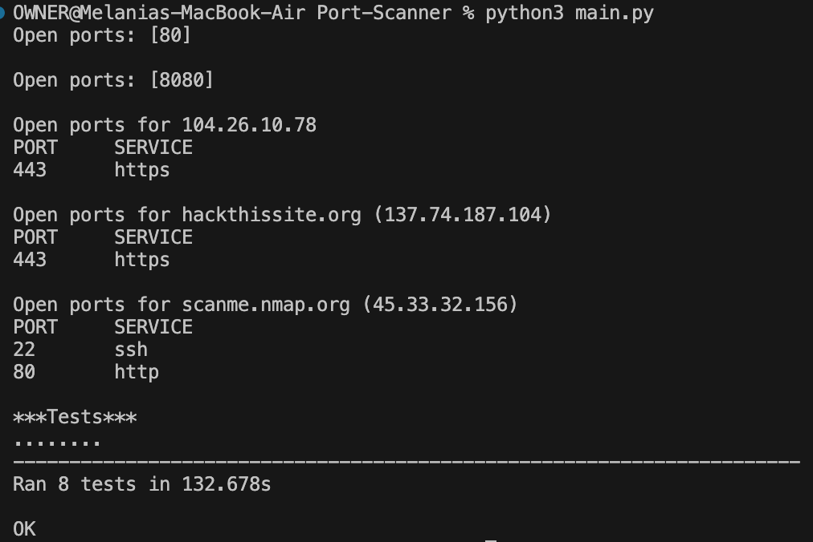

# 🔍 Port Scanner

A Python-based TCP port scanner that scans a given IP address or hostname over a specified range of ports. It identifies open ports and optionally outputs a verbose report showing service names.

## Project Structure: 

```
Port-Scanner/
├── main.py              # Sample executions and test runner
├── port_scanner.py      # Core scanning logic
├── common_ports.py      # Dictionary mapping ports to services
├── test_module.py       # Unit tests for automated validation
└── README.md            
```

## Build Instructions

Clone this repository and run:
```bash
python3 main.py
```
Your result should look like:


## Credits:

This is the boilerplate for the Port Scanner project. Instructions for building your project can be found at: 
https://www.freecodecamp.org/learn/information-security/information-security-projects/port-scanner
